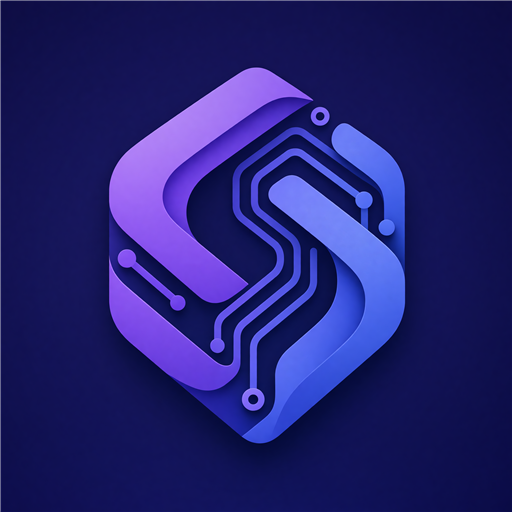

<p align="center">
  
</p>

<h1 align="center">windows-mcp-highspeed</h1>

<p align="center">A fast <a href="https://modelcontextprotocol.io">Model Context Protocol</a> server that automates Windows desktop applications through the <strong>UI Automation (UIA) accessibility tree</strong> — pure semantic tree navigation and window handles, <strong>no screenshots</strong>.</p>

Because it reads the same structured tree that screen readers use, it is dramatically faster and more reliable than pixel-based automation: a `snapshot` of the desktop completes in milliseconds, and every interaction targets elements by identity, not by coordinates. Compared to the established Python/Node MCP UIA servers, the whole accessibility layer runs pinned to a single COM thread with batched cache requests, removing most cross-process round trips that make those implementations feel sluggish.

## Support this project

`windows-mcp-highspeed` is free for personal use. If it saves you time, you can buy the author a coffee via Alipay:


Businesses using it commercially are asked to [purchase a license](#license).

## Features

- **9 MCP tools**: `snapshot`, `find_elements`, `describe`, `invoke`, `set_value`, `get_text`, `scroll`, `wait_for_element`, `highlight`.
- **Semantic tree access only** — no screenshots, no OCR, no coordinate guessing.
- **Locator engine** (`//Window[@Name='Notepad']//Edit`) with an XPath-like grammar: child/descendant axes, control-type and attribute predicates (`=`, `!=`, `*=`), nth-match index.
- **Element references**: `find_elements` returns opaque `ref` strings that later tools re-resolve by identity (runtime id) with graceful `StaleElement` detection.
- **Native-condition fast path**: simple locators are compiled to native UIA conditions and executed by the provider, not by walking the tree.
- **Cache-request batching**: snapshots prefetch all node properties per level in one cross-process call.
- **Structured tool errors**: every failure returns `{"error": {"code", "message", "hint"}}` so the model can recover on its own.
- **Click-through highlight overlay** for human debugging of what the model "sees".

## Requirements

- Windows 10 or 11 (x86_64), an interactive (unlocked) desktop session.
- MSVC runtime (installed with Visual Studio Build Tools 2019+); the release binary is a single `.exe`.
- To automate applications running **elevated** (as administrator), the server itself must run elevated; the Windows secure desktop (UAC prompts) is unreachable by design.

## Build

```bash
cargo build --release
```

The binary is `target\release\windows-mcp-highspeed.exe`.

## Usage with MCP clients

The server speaks MCP over stdio (newline-delimited JSON-RPC). Logs go to stderr only, so stdout stays protocol-clean.

**Claude Desktop** (`claude_desktop_config.json`):

```json
{
  "mcpServers": {
    "windows-mcp-highspeed": {
      "command": "C:\\Users\\novaw\\Desktop\\Workspaces\\Windows-MCP-Highspeed-Rust\\target\\release\\windows-mcp-highspeed.exe"
    }
  }
}
```

**Cursor** (`~/.cursor/mcp.json`):

```json
{
  "mcpServers": {
    "windows-mcp-highspeed": {
      "command": "C:\\Users\\novaw\\Desktop\\Workspaces\\Windows-MCP-Highspeed-Rust\\target\\release\\windows-mcp-highspeed.exe"
    }
  }
}
```

Build the release binary first — the config above points at `target\release\windows-mcp-highspeed.exe`.

## Tool reference

| Tool | Description | Key parameters |
|---|---|---|
| `snapshot` | Capture a JSON snapshot of the UIA tree. | `root_mode` (desktop\|foreground\|cursor), `hwnd`, `pid`, `locator` (root overrides), `depth` (8), `max_children` (64), `filter`, `name_contains`, `include_offscreen`, `max_value_length` (128) |
| `find_elements` | Find elements by locator; returns refs. | `locator` (required), root options as above, `max_results` (32), `timeout_ms` (0 = single pass) |
| `describe` | Full property dump of a referenced element. | `ref` |
| `invoke` | Pattern actions: invoke, toggle, expand, collapse, select, scroll_into_view, close. | `ref`, `action` (invoke) |
| `set_value` | Write text (ValuePattern, with keyboard fallback via SendInput). | `ref`, `value`, `method` (auto\|value\|keyboard) |
| `get_text` | Read text (ValuePattern, fallback TextPattern). | `ref` |
| `scroll` | Scroll element or nearest scrollable ancestor. | `ref`, `direction` (down), `amount` (3) |
| `wait_for_element` | Poll until a locator matches; returns matches + `elapsed_ms`. | `locator`, root options, `timeout_ms` (10000), `poll_ms` (200) |
| `highlight` | Draw a colored border overlay on the element (human debugging). | `ref`, `duration_ms` (1500), `color` (red) |

Root selection precedence for the tree tools: `hwnd` > `pid` > `locator` (root override) > `root_mode`.

## Locator syntax

```
locator   := ("//" | "/") step (("/" | "//") step)*
step      := ("*" | ControlType) ("[" predicate "]")?
predicate := "@" attr ("=" | "!=" | "*=") quoted-string | integer
attr      := Name | AutomationId | ClassName | Value
```

- `//` searches all **descendants**; `/` searches **direct children**.
- `ControlType`: `Window`, `Button`, `Edit`, `Text`, `ComboBox`, `List`, `ListItem`, `Tree`, `TreeItem`, `Menu`, `MenuItem`, `Tab`, `TabItem`, `CheckBox`, `RadioButton`, `Hyperlink`, `Document`, `Pane`, `Group`, `ToolBar`, `StatusBar`, `DataGrid`, `DataItem`, `ScrollBar`, `ProgressBar`, `Slider`, `Spinner`, `ToolTip`, `Custom`, and the rest of the UIA control types. `*` matches any type.
- Operators: `=` exact (with case-insensitive fallback), `!=` case-insensitive inequality, `*=` case-insensitive contains. String comparison is case-insensitive for `!=` and `*=`.
- An integer predicate selects the n-th (1-based) match of that step: `//Button[2]`.
- Multiple predicates per step are comma-separated.

Examples:

```
//Window[@Name='Notepad']//Edit        the Notepad editor
//Button[@Name*='save']                any button whose name contains "save"
//Button[@AutomationId='ok'][1]        first button with automation id "ok"
//*[@AutomationId='MainMenu']          any control type with this automation id
/Window/Tab/TabItem[@Name='Settings']  direct-child path
```

Single-step locators (`//Button[@Name='OK']`, `//*[@ClassName='RichEditD2DPT']`, ...) are translated into native UIA conditions — the provider filters the tree without a client-side walk. Multi-step locators use tree matching.

## Element references

Tools that act on one element take a `ref` string produced by `find_elements`:

```json
{"rid":[42,65536,3],"query":"//Window[@Name='Notepad']//Edit"}
```

- `rid` is the UIA **runtime id** captured at discovery time; it is used for identity *comparison* when the reference is re-resolved.
- `query` is the locator that found the element; re-running it is the actual re-resolution mechanism (UIA exposes no `ElementFromRuntimeId`).

Resolution order: re-run `query` → return the match whose runtime id equals `rid` → else the unique match → else `StaleElement` with advice to re-run `find_elements`.

## Performance notes

- **One COM thread**: `IUIAutomation` is initialized once (MTA) on a dedicated worker thread; every UIA call is serialized through a job queue, so all cross-process traffic stays on one thread with no lock contention.
- **Cache requests**: `snapshot` builds a `UICacheRequest` (name, control type, automation id, class, bounding rect, offscreen, framework id, value, pattern availability) and fetches each level's children with `FindAllBuildCache` — roughly one cross-process round trip per node instead of one per property.
- **Native condition fast path**: simple `find_elements` locators compile to a UIA property condition and run inside the target's provider. When a native search under a *window* root returns nothing, the result is double-checked with the tree-walker matcher: some providers (e.g. the Windows 11 Notepad editor) serve a shallower view to window-rooted `FindAll` than to the walker, and this keeps `find_elements` consistent with what `snapshot` shows. Desktop-rooted searches need no verification.
- **Panic containment**: UIA jobs run behind `catch_unwind` on the worker thread, so a panicking job becomes a normal tool error instead of wedging the only COM thread.
- **Async everywhere else**: MCP handling and polling loops run on Tokio; UIA work is submitted as jobs and awaited with per-job deadlines (a hung provider cannot wedge the client past its timeout).

## Limitations

- **Elevated targets** require the server to run elevated; the UAC secure desktop is unreachable.
- **Custom-drawn / DirectX / game UIs** have no accessibility tree — there is nothing to automate.
- **RDP**: an RDP session that is locked, minimized or disconnected has no interactive desktop; UIA calls will fail or return stale data.
- **Virtualized lists** (Explorer, large grids) only materialize items while visible: scroll first, or use the `ScrollItem`/`Scroll` patterns.
- **Chromium/Electron** trees are enormous — use `filter`, `name_contains`, and small `depth` values.
- **Modal dialogs are separate top-level windows**: a dialog opened by an app does not appear inside that app's window subtree — search from the desktop (`root_mode: "desktop"`) to find it.
- **Flaky provider views**: some apps (WinUI islands, the Windows 11 Notepad editor) expose a shallower subtree to window-rooted `FindAll` than to the tree walker. `find_elements` detects this and re-verifies empty results with the walker, at the cost of a slower search in that rare case.
- **Hung providers**: UIA offers no cancellation; a broken provider can block the worker thread (the client still gets a `Timeout` error, but the thread stays blocked until the provider returns).
- `set_value` via the keyboard path is capped at 4000 characters and BMP characters only.

## Roadmap

- Push notifications for UIA structure-changed events (tree diffs pushed to the client instead of polling).
- CDP backend for web content inside Chromium/Electron apps.
- More XPath axes (`following-sibling`, `ancestor`, ...).

## License

Free for **personal and non-commercial** use (including evaluation, research and education).

**Commercial use requires a paid license** — this covers use inside a company or any revenue-generating activity, embedding the software into a product or service you sell or host for a fee, and using it to deliver paid automation/consulting services.

To purchase a commercial license, contact: [novaweb6868@outlook.com](mailto:novaweb6868@outlook.com)

Full terms: [LICENSE](LICENSE).
